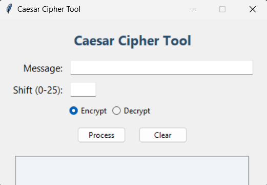

# Caesar Cipher Tool

A simple and user-friendly **Caesar Cipher** encryption and decryption tool with a modern Tkinter GUI. Easily encrypt or decrypt messages with a custom shift value.  
This project also provides a standalone `.exe` file for quick use without Python installation.

---

## Features

- **Encrypt & Decrypt** messages using the Caesar Cipher algorithm
- **Intuitive GUI** built with Tkinter
- **Input validation** for shift values
- **Clear output display**
- **Standalone `.exe`** for Windows users (no Python required)

---

## Screenshots

 

---

## How to Use

### 1. Using the `.exe` File

1. Download the latest `Caesar_Cipher_Tool.exe` from the [releases](#) (or your distribution location).
2. Double-click to run.  
   _No Python installation required!_

### 2. Running from Source

#### Requirements

- Python 3.x

#### Steps

1. **Clone the repository:**
    ```sh
    git clone https://github.com/Nischayabeniwal/CODECRAFT_CS_01.git
    cd CODECRAFT_CS_01
    ```

2. **Run the application:**
    ```sh
    python main.py
    ```

---

## How It Works

1. Enter your message in the **Message** field.
2. Enter a **Shift** value (0-25).
3. Select **Encrypt** or **Decrypt**.
4. Click **Process** to see the result.
5. Use **Clear** to reset all fields.

---

## Building the `.exe` Yourself

If you want to generate the `.exe` file:

1. Install [PyInstaller](https://pyinstaller.org/):
    ```sh
    pip install pyinstaller
    ```
2. Run:
    ```sh
    pyinstaller --onefile --windowed main.py
    ```
3. The `.exe` will be in the `dist` folder.

---

## License

This project is licensed under the  License.

---

## Author

- [Nischaya](https://github.com/Nischayabeniwal)
